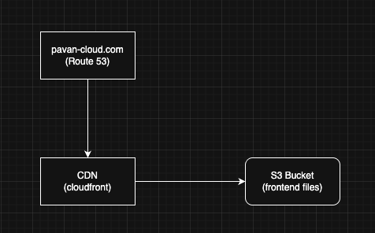

# 🌩️ Cloud Resume Challenge – Debug Notes (Chunk 1)

## 🧠 What I Learned

I was trying to host my **Cloud Resume Challenge** website on AWS using **S3 + CloudFront + Route 53**.  
At first, everything looked fine, but when I opened my site `https://pavan-cloud.com`, I got this error:

```
This site can’t be reached  
pavan-cloud.com’s DNS address could not be found.  
DNS_PROBE_POSSIBLE
```

Initially, I thought the issue was with **CloudFront**, but after some digging, I realized the real problem was with **Route 53 and the nameserver mismatch**.

---

## 🧩 The Real Issue

I had **two different sets of name servers**, which caused my domain to point to the wrong hosted zone.

- **Registered Domain (under Route 53 → Registered Domains):**
  ```
  ns-1088.awsdns-08.org
  ns-557.awsdns-05.net
  ns-1686.awsdns-18.co.uk
  ns-88.awsdns-11.com
  ```

- **Hosted Zone (under Route 53 → Hosted Zones):**
  ```
  ns-707.awsdns-24.net
  ns-1213.awsdns-23.org
  ns-305.awsdns-38.com
  ns-1670.awsdns-16.co.uk
  ```

Since these didn’t match, my domain couldn’t find the correct DNS zone, which is why it failed to resolve to my CloudFront distribution.

Basically — **the domain was pointing to the wrong hosted zone.**

---

## 🔧 How I Fixed It

1. Went to **Route 53 → Registered Domains → pavan-cloud.com**
2. Edited the **Name Servers** and replaced them with the ones from my **Hosted Zone**:
   ```
   ns-707.awsdns-24.net
   ns-1213.awsdns-23.org
   ns-305.awsdns-38.com
   ns-1670.awsdns-16.co.uk
   ```
3. Waited around **30–60 minutes** for DNS propagation to complete.
4. Checked propagation using [dnschecker.org](https://dnschecker.org).
5. Once it started resolving to my CloudFront distribution (`d1tb64qqhejxg3.cloudfront.net`), the site loaded successfully 🎉.

---

## 🏗️ Architecture Diagram

Here’s the setup I used for this project:



**Explanation:**
- **Route 53** manages the domain `pavan-cloud.com`
- **CloudFront (CDN)** distributes and caches content globally with HTTPS
- **S3 Bucket** securely stores all static frontend files
- CloudFront fetches data from S3 through **Origin Access Control (OAC)**

---

## 💡 Key Takeaways

- If you see `DNS_PROBE_POSSIBLE`, first check if your **domain’s nameservers** and **Route 53 hosted zone nameservers** match.
- Never edit the **SOA record** — AWS manages that automatically.
- Keep your **S3 bucket private** and let CloudFront handle delivery.
- Always set your **Default Root Object** in CloudFront to `index.html`.
- Be patient — DNS changes can take **30 minutes to a few hours** to fully propagate.

---

## ✅ Final Setup Recap

| AWS Service | Purpose |
|--------------|----------|
| **S3 Bucket** | Stores static frontend files (private) |
| **CloudFront (CDN)** | Distributes website globally & provides HTTPS |
| **Route 53** | Manages DNS records and domain routing |
| **ACM Certificate** | Provides SSL/TLS security (`us-east-1` region) |

Everything is working smoothly now 🚀

---

### 🧾 Quick Note
If you ever run into a similar issue again, first thing to check:
```
# Always make sure
Hosted Zone NS = Registered Domain NS
```

---

**Author:** Sai Pavan Tej Bobba  
**Project:** AWS Cloud Resume Challenge (Chunk 1 – Route 53 & DNS Fix)
