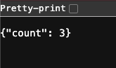

# Cloud Resume Challenge – Backend (Chunk 2)

## Problem
Need a backend that tracks website visits.

Requirements:
- Store a single counter in DynamoDB.
- Increment the counter on every request.
- Expose the counter through a public API.
- Use Lambda + API Gateway + DynamoDB with least-privilege IAM.

## Approach
DynamoDB table created with one item:

```
id = "visitors"
count = 0
```

Lambda built in Python.  
Lambda reads the item, increments the number, writes back, returns JSON.

IAM inline policy added to the Lambda role to allow:
- dynamodb:GetItem
- dynamodb:UpdateItem

API Gateway (HTTP API) exposes a GET route:
`/counter` → triggers Lambda.  
Lambda output returned directly to the caller.

Result:  
Public URL increments the counter every time it’s accessed.

## Architecture
Add your architecture diagram here:
```

```

## Lambda Code
```
import os
import json
import boto3
from decimal import Decimal

dynamodb = boto3.resource("dynamodb")
table = dynamodb.Table(os.environ["TABLE_NAME"])

def lambda_handler(event, context):
    result = table.update_item(
        Key={os.environ["PRIMARY_KEY"]: os.environ["PRIMARY_KEY_VALUE"]},
        UpdateExpression="SET #c = if_not_exists(#c, :start) + :one",
        ExpressionAttributeNames={"#c": "count"},
        ExpressionAttributeValues={
            ":start": Decimal(0),
            ":one": Decimal(1)
        },
        ReturnValues="UPDATED_NEW"
    )

    count = int(result["Attributes"]["count"])

    return {
        "statusCode": 200,
        "headers": {"Content-Type": "application/json"},
        "body": json.dumps({"count": count})
    }
```

## API Gateway Result
Add image:
```

```
